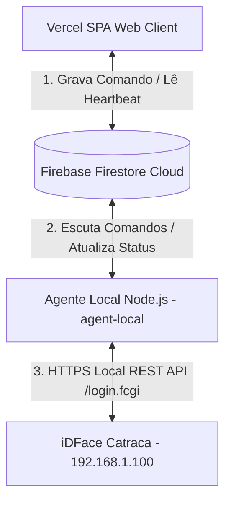

# Plano de Implementação — Integração Control iD (iDFace) via Agente Local

Este documento descreve o plano detalhado para implementar a integração da catraca/controladora **Control iD iDFace** com a aplicação web **Carrasco Fit** publicada na Vercel. A arquitetura proposta resolve o impedimento físico de redes (a Vercel não consegue alcançar o IP local `192.168.1.100` diretamente) introduzindo um **Agente Local** leve, seguro e performático em execução na LAN da academia.



---

## 1. Diretrizes e Regras de Segurança (P0)

Para garantir segurança a nível de produção, seguiremos estritamente as restrições fornecidas:
1. **Isolamento de Credenciais:** A senha da catraca (`admin`) permanecerá exclusivamente no arquivo `.env` do Agente Local. Ela **nunca** será gravada no frontend ou enviada ao Firestore.
2. **Ponto de Acesso Local Único:** O frontend na Vercel e o servidor de produção nunca farão requisições HTTP diretas ao IP `192.168.1.100`. Toda comunicação com a catraca local será mediada pelo Agente Local usando o Firestore como canal assíncrono.
3. **Confirmação Manual:** A liberação manual exigirá uma janela de confirmação de segurança (`window.confirm`) antes de disparar o comando.
4. **Prevenção de Duplicidade:** O Agente Local marcará o comando como `processing` usando filtros de status atômicos (`where("status", "==", "pending")` ou transações) antes da execução física, garantindo que o comando seja processado uma única vez.
5. **Comunicação Segura & Timeout:** As chamadas HTTPS do Agente à catraca local ignorarão certificados autoassinados (comum no firmware iDFace) e terão um limite máximo de timeout de 5 segundos para evitar travamentos.
6. **Sanitização de Logs:** Nenhum log local ou enviado à nuvem conterá tokens de sessão, senhas ou dados pessoais restritos.

---

## 2. Proposta de Alterações

Mapeamos a necessidade de criar um novo módulo no repositório (`agent-local/`) e ajustar componentes frontend e rotas de status existentes no backend Express.

---

### Componente 1: Agente Local (`agent-local/`)

Será um subprojeto Node.js/TypeScript independente contido na pasta raiz do repositório. Ele utilizará o `firebase-admin` com uma credencial de conta de serviço local para escutar e atualizar o Firestore.

#### [NEW] [package.json](file:///c:/Projetos%20Lovable.dev/academiacarrasco/agent-local/package.json)
Definição de dependências do agente:
* `firebase-admin` (acesso privilegiado ao Firestore).
* `axios` ou `node-fetch` (requisições HTTP à API do iDFace).
* `dotenv` (carregamento de credenciais locais).
* `typescript`, `tsx` (compilador e executor TypeScript em desenvolvimento).

#### [NEW] [tsconfig.json](file:///c:/Projetos%20Lovable.dev/academiacarrasco/agent-local/tsconfig.json)
Configurações básicas do TypeScript para compilação estrita.

#### [NEW] [.env.example](file:///c:/Projetos%20Lovable.dev/academiacarrasco/agent-local/.env.example)
Modelo das variáveis de ambiente locais do agente:
```ini
# Configurações do Firebase
FIREBASE_SERVICE_ACCOUNT_PATH=./serviceAccountKey.json

# Configurações do iDFace
CATRACA_IP=192.168.1.100
CATRACA_PORT=443
CATRACA_PROTOCOL=https
CATRACA_USER=admin
CATRACA_PASSWORD=admin
CATRACA_MODEL=idface # idface, idblock ou idflex
CATRACA_RELEASE_ACTION=sec_box # sec_box, door ou catra
```

#### [NEW] [agent.ts](file:///c:/Projetos%20Lovable.dev/academiacarrasco/agent-local/agent.ts)
A lógica principal do Agente Local que realiza:
1. **Inicialização:** Conecta ao Firestore usando a conta de serviço local do Firebase.
2. **Heartbeat (Status):** Executa uma verificação a cada 10 segundos chamando `/login.fcgi` localmente. Atualiza o documento `settings/hardware_status` no Firestore com o status (`online`/`offline`), IP, modelo, e a data de atualização.
3. **Fila de Comandos (Escuta):** Subscreve-se à coleção `hardwareCommands` buscando documentos onde `status == 'pending'`.
4. **Execução:**
   * Altera o status do comando imediatamente para `processing`.
   * Realiza login no iDFace obtendo o token de sessão.
   * Executa a rota correta do iDFace baseada no comando (ex: `/execute_actions.fcgi` para liberação manual).
   * Em caso de sucesso, atualiza o status do comando para `success`.
   * Em caso de falha, atualiza para `error` e anexa a mensagem de erro.
   * Desconecta/faz logout (`/logout.fcgi`) de forma limpa.

#### [NEW] [README.md](file:///c:/Projetos%20Lovable.dev/academiacarrasco/agent-local/README.md)
Documentação passo a passo detalhando como o gerente da academia pode baixar a chave de serviço do Firebase Console, configurar o `.env` e inicializar o agente local na máquina.

---

### Componente 2: Frontend SPA (React 19)

#### [MODIFY] [Turnstile.tsx](file:///c:/Projetos%20Lovable.dev/academiacarrasco/src/components/Turnstile.tsx)
* Modificar a função `handleRelease` (linha 787) para incluir uma confirmação visual explícita antes de gerar o comando no Firestore:
```typescript
const handleRelease = async () => {
  if (!window.confirm("Confirmar liberação manual da catraca física?")) return;
  setIsReleasing(true);
  addHardwareLog("[SISTEMA] Solicitando liberação manual via Agente...");
  const success = await releaseTurnstile();
  // ...
};
```
* Otimizar os blocos visuais de status para indicar claramente que a catraca está sendo monitorada via **Agente Local** na nuvem, exibindo o último contato recebido da academia.

---

### Componente 3: Express Backend Gateway (`server.ts`)

#### [MODIFY] [server.ts](file:///c:/Projetos%20Lovable.dev/academiacarrasco/server.ts)
* Garantir que a rota `/api/hardware/status` (linha 744) busque diretamente o status do documento `settings/hardware_status` no Firestore. Dessa forma, mesmo rodando na Vercel (onde as variáveis locais em memória estariam vazias), o backend fornecerá o status exato relatado em tempo real pelo Agente Local! Isso garante compatibilidade retroativa total com a interface web existente.

---

## 3. Plano de Verificação (Testes)

Para provar o funcionamento da integração sem quebrar equipamentos físicos:

### 1. Simulação & Validação Local
* Rodar o Agente Local apontando para um IP de teste ou simulando respostas do iDFace via HTTP mock.
* Verificar se a transição de estados de comandos (`pending` -> `processing` -> `success`) ocorre corretamente no Firestore Console.
* Validar se a Vercel reflete o status online da catraca atualizado pelo Agente.

### 2. Implantação no Equipamento Real
* Validar a autenticação segura do agente em relação à catraca local (`https://192.168.1.100/login.fcgi`).
* Disparar a liberação manual no painel web da Vercel e cronometrar a resposta da catraca física local.

---

## 4. Questões Abertas e Feedback do Usuário

> [!NOTE]
> **Perguntas Importantes para o Usuário:**
> 1. Você já possui o arquivo JSON de Chave de Serviço do Firebase (`serviceAccountKey.json`) ou precisa que eu inclua no `README.md` um tutorial detalhado de como gerá-lo no Firebase Console?
> 2. O equipamento de controle de acesso está atualmente utilizando a rota `/execute_actions.fcgi` (padrão iDFace) ou `/sec_box` para liberação manual? Deixarei o agente parametrizável via `.env` para suportar ambos, mas ter essa informação nos ajudará a validar as chaves exatas de envio!
